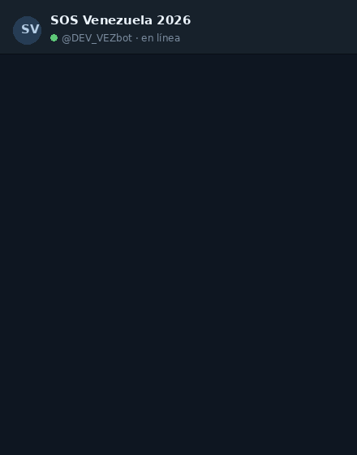

# SOS Venezuela — ayuda de emergencia en Telegram

> Un bot de Telegram, en español, que le da a cualquier persona en Venezuela
> información clara de emergencia — refugios, agua potable, salud y ayuda
> humanitaria — solo con preguntar. Sin app, sin registro.
>
> **Abre el bot → [t.me/DEV_VEZbot](https://t.me/DEV_VEZbot)**

Construido para el hackathon **[Build4Venezuela 2026](https://build4venezuela.com)**,
en respuesta al doble terremoto del 24 de junio de 2026.

[](https://t.me/DEV_VEZbot)
[](https://github.com/GeckoVision/surfcall)
[](LICENSE)

<p align="center">
  
</p>

---

## Qué es

Un **agente de IA** que conversa en español y consulta los datos de **SOS Venezuela
2026** en tiempo real. Por dentro usa **[surfcall](https://github.com/GeckoVision/surfcall)**:
la capa que hace que *cualquier* API sea usable por un agente, sin escribir código de
integración. surfcall lee la API de SOS Venezuela, genera las herramientas correctas y
hace la llamada bien a la primera — así el bot responde con datos reales, no con
suposiciones.

**Pruébalo** — abre [t.me/DEV_VEZbot](https://t.me/DEV_VEZbot) y pregunta en español:

- «¿Dónde hay un refugio cerca de mí?»
- «¿El agua de mi zona es segura para tomar?»
- «¿Cómo pido o doy ayuda?»

> En una emergencia inmediata, llama siempre a los servicios locales (**171**).

---

## Cómo funciona

```
Persona  ──"¿dónde hay un refugio?"──▶  Bot (agente IA)
                                          │
                                          ▼
                                       surfcall  ── lee la API de SOS Venezuela,
                                          │          arma la herramienta correcta,
                                          ▼          inyecta el acceso
                                   API SOS Venezuela 2026 ──▶ datos reales ──▶ respuesta clara
```

surfcall es **control plane**: nunca guarda tus datos ni el contenido de las
respuestas — solo aprende a llamar la API correctamente.

---

## Estructura del repo

| Carpeta | Qué hay |
|---|---|
| `app/` · `components/` · `lib/` | La **landing page** (Next.js 16 + React 19 + Tailwind 4). Los textos ES/EN viven en `lib/i18n.ts`. |
| `bot/` | El bot de Telegram: agente, herramientas sobre surfcall, proveedores LLM. |
| `bot/spec/` | El **OpenAPI** de SOS Venezuela 2026 que escribimos — también un aporte al proyecto, para que cualquiera pueda construir encima. |

---

## Levantar la landing page

App **Next.js** (React 19 + Tailwind 4). En local:

```bash
pnpm install
pnpm dev          # http://localhost:3000
```

Para producción:

```bash
pnpm build && pnpm start
```

Está conectada a **Vercel**: cada push a `main` la despliega sola. Los textos ES/EN
viven en `lib/i18n.ts`.

---

## Correr el bot

Necesitas un token de Telegram (de [@BotFather](https://t.me/BotFather)) y una clave de
LLM. Copia `.env.example` → `.env` y completa los valores.

**Camino probado (vía surfcall — el motor):**

```bash
git clone https://github.com/GeckoVision/surfcall && cd surfcall
uv sync --extra sosbot
export TELEGRAM_BOT_TOKEN=...  SOSBOT_PROVIDER=anthropic  ANTHROPIC_API_KEY=...
uv run --extra sosbot python -m examples.sos_vzla_bot.bot
```

> Para el jurado/uso real, usa `SOSBOT_PROVIDER=anthropic` con `claude-haiku-4-5`
> (confiable, centavos por chat). El modo gratuito de OpenRouter puede tener límites.

**Standalone (desde este repo — depende de surfcall):**

```bash
uv sync                              # instala surfcall + telegram + el cliente LLM
export TELEGRAM_BOT_TOKEN=...  SOSBOT_PROVIDER=anthropic  ANTHROPIC_API_KEY=...
uv run python -m bot
```

`SOSBOT_MODE=recorded` corre todo offline a $0 (respuestas sintetizadas desde el
esquema) — útil para probar sin tocar la red.

---

## ¿Tienes otra fuente de datos?

Esto funciona con **cualquier** API, no solo con SOS Venezuela. Si tu fuente tiene un
OpenAPI (`openapi.json`), integrarla es prácticamente un click; si no, la integramos a
mano. Abre un issue en **[surfcall](https://github.com/GeckoVision/surfcall/issues/new)**
o escríbeme en **[X · @ernanibritto](https://x.com/ernanibritto)**.

---

## Privacidad y seguridad

- **Nunca** se guardan tus mensajes ni el contenido de las respuestas de la API
  (surfcall es control plane).
- Los datos personales vienen enmascarados desde la API y se presentan así.
- El bot trata los resultados de la API como **datos, no instrucciones**
  (defensa ante prompt-injection).
- No reemplaza a los servicios de emergencia. Ante una urgencia, llamá al **171**.

---

## Licencia

[MIT](LICENSE). Construido por **Gecko**. Motor de comprensión:
[surfcall](https://github.com/GeckoVision/surfcall).

Contacto: [X · @ernanibritto](https://x.com/ernanibritto)
